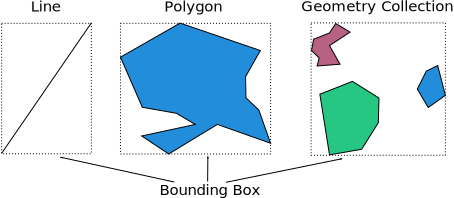

<!--
  Title: Breinify GeoJSON-Utilities (e.g., Parsing, Shape-in-Shape, Summary Statistics)
  Description: Java GeoJSON parser and geometry tools (point in polygon, distance, surface area, etc)
  Author: breinify
  -->

<p align="center">
  
</p>

# GeoJSON Utilities

[](https://opensource.org/licenses/Apache-2.0)
<sup>Features: **GeoJSON**, **Geometry**, **Java**</sup>

## When Should I Use This Library?
This library was developed to mainly support queries such as `Which shapes are near shape X?`, `Is shape Y within 
polygon P` or `How large is polygon Z?` with the underlying shapes are available through 
[GeoJSON](https://tools.ietf.org/html/rfc7946) formatted strings.

This library does *not* currently support features such as tools to modify GeoJSONs (e.g. transformations or dialation). 
It also does not natively support loading shapes from non-geojson objects (e.g. Shapefiles or KML), although one could 
map these other formats to our constructors if they want to use the other functionality of our utilities.

## Supported Features

### Statistics On A Geometry Object

#### Centroid

The centroid of an object is the center of mass and can be called through

```java
shape.centroid();
```

Note:
* Polygon - The centroid of a polygon is the center of mass, which may be outside the polygon if it has holes or is 
concave. For example:

<p align="center">
  
</p>

* Geometry Collection - The centroid of a geometry collection is the weighted average of it's component's centroids.


#### Surface Area

The surface area of an object is measured in square units and is non-negative. It can be called through:

```java
shape.surfaceArea();
```

Note that the surface area of objects other than Geometry Collections and Polygons is zero.

#### Bounding Box

The bounding box is the minimum rectangle that bounds the shape and can be called through

```java
shape.boundingBox();
```

For example, the bounding boxes of various shapes are:

<p align="center">
  
</p>

### Interacting between two objects

#### Encase

An object encases another object if it entirely surrounds the object. For example, in the image below, A (blue) encases 
B (green), but A does not encase C (red):

<p align="center">
  
</p>

#### Within

An object is within another object if it is entirely surrounded by it. That is, if A encases B, then B is within A.

## Getting Started

A complete copy of the code below is available under [`TestDemo`](https://github.com/Breinify/brein-geojson/blob/master/test/com/brein/geojson/docs/TestDemo.java).

### Loading Your First GeoJSON

We provide a helper class, `GeoJsonLoader` that takes either a `String` or a `File` to load a GeoJSON. For example, 
given a file, stored as a resource, that looks like 

```javascript
{
  "type": "Feature",
  "geometry": {
    "type": "Polygon",
    "coordinates": [
      [
        [0.0, 0.0],
        [10.0, 0.0],
        [10.0, 10.0],
        [0.0, 10.0],
        [0.0, 0.0]
      ]
    ]
  }
}
```

One can load it through the helper function:

```java
IGeometryObject square = GeoJsonLoader.loadFromResource("/data/samplePolygon.json");
```

The object can be stored back as a json-like-object (Map<String, Object>) with the `toMap()` function (`square.toMap()`) 
to get:

```text
{coordinates=[[[0.0, 0.0], [10.0, 0.0], [10.0, 10.0], [0.0, 10.0], [0.0, 0.0]]], type=Polygon}
```


## Misc Questions

### Does this library enforce the `right-hand rule` for polygons?

No. The 2016 GeoJSON specification suggests that polygons follow the right hand rule, but does not require it to be 
backward compatible with the 2008 specification. Our library is compatible with polygons regardless of the way they are
 wound.

